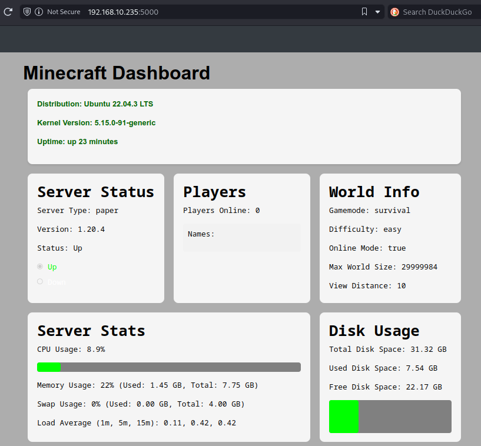

# Minecraft Server Linux Installer


## Table of Contents
1. [Using install.sh](#instructions-on-using-the-installsh-script)
2. [Using install-full.sh](#instructions-on-using-the-install_fullsh-script)
3. [Docker Container](#using-the-docker-container)
4. [Connecting](#connecting)

## Introduction/Overview
This script automates the installation and setup of a Minecraft server on Ubuntu Server 22.04. It simplifies the process of getting a Minecraft server operational by handling tasks such as installing necessary packages, opening ports, downloading the server JAR file, accepting the Minecraft EULA, setting file ownership and permissions, and creating a systemd service for server management.

## Features
- Adds Java PPA and installs OpenJDK 17.
- Opens ports for Minecraft and SSH.
- Offers a choice of Minecraft server software: Paper, Purpur, or Vanilla.
- Downloads the specified version of the selected Minecraft server JAR file.
- Automatically accepts the Minecraft EULA.
- Sets file ownership and permissions for security.
- Creates a systemd service for easy server management.
- Provides customization instructions for `server.properties`.

## Distributions Tested
- **Ubuntu Server 22.04**
- **Ubuntu Server 20.04**
- **Ubuntu Server 18.04**
- **Debian 11**

Docker image will work with any distro and windows

# Instructions on Using the 'install.sh' Script
1. **Download the script:**  

Download the script to your server.
   
```bash
wget https://raw.githubusercontent.com/keepittechie/mcsli/main/install.sh
```
2. **Run the Installation Script:**

Execute the install.sh script. The script must be run with root privileges.

```bash
sudo bash ./install.sh
```

*Note: If the script doesn't run, this could be that the script is not executable.*
```bash
chmod +x install.sh
```
*Run again:*
```bash
sudo bash ./install.sh
```  

3. **Review and Customize server.properties:**

After the script has completed, you can find the server.properties file in the Minecraft server directory (/opt/minecraft). Customize this file as needed based on your server preferences. Refer to the Official Minecraft Wiki for a detailed list of server properties.

4. **Start the Minecraft Server:**

Manually start the Minecraft server using the following command:

```bash
sudo systemctl start minecraft.service
```

# Instructions on Using the 'install_full.sh' Script



This script will install both mcsli & mcsli_webui.

1. **Download the Script:**  

Download the script to your server.
   
```bash
wget https://raw.githubusercontent.com/keepittechie/mcsli/main/install_full.sh
```
2. **Run the Installation Script:**

Execute the install_full.sh script. The script must be run with root privileges.

```bash
sudo bash ./install_full.sh
```

*Note: If the script doesn't run, this could be that the script is not executable.*

```bash
chmod +x install_full.sh
```
*The run again:*

```bash
sudo bash ./install_full.sh
```  

3. **Review and Customize server.properties:**

After the script has completed, you can find the server.properties file in the Minecraft server directory (/opt/minecraft). Customize this file as needed based on your server preferences. Refer to the Official Minecraft Wiki for a detailed list of server properties.

4. **Start the Minecraft Server:**

Manually start the Minecraft server using the following command:

```bash
sudo systemctl start minecraft.service
```

5. **Access the mcsli_webui:**

To access the webui goto link:

```bash
http://localhost/5000
```
or
```bash
http://ip-address/5000
```

## Using the docker container

**Note: the docker container does not include the web ui. If you know a solution to this, please feel free to contribute**
1. Make sure you have [docker](https://docs.docker.com/engine/install) and [docker compose](https://docs.docker.com/compose/install/#scenario-two-install-the-compose-plugin) installed
2. Make a ``docker-compose.yml`` file with these contents. Change the values as desired:
```yaml
version: '3.9'
services:
    mcsli-docker:
      container_name: mcsli-docker
      image: sz27/mcsli:latest
      volumes:
        - ./config:/opt/minecraft
      environment:
        - SERVER_SOFTWARE=purpur
        - SERVER_VERSION=1.20.4
        - MAX_RAM=1G
        - MIN_RAM=1G
      ports:
        - 25565:25565
        # - 19132:19132 # Optional, uncomment if you want to run geyser
```
*Note: there is also a ``bleeding`` tag that matches the ``test`` branch. It cant be guaranteed that this will always function properly.*

3. Run ``docker compose up -d``

4. If and when you need to run a command on the server, you can run:
```bash
docker exec -it mcsli-docker /rcon-cli --port 25575 --password mcsli-docker
```
If you changed the rcon password (recommended) or container name, you will have to subsitute either (or both) of the ``mscli-docker``'s for those values

### Available config options:

variabe|options
---|---
SERVER_SOFTWARE|purpur (default), paper, vanilla
SERVER_VERSION|Any valid minecraft version (default, 1.20.4); **must be the full version, like *1.20.4***
MIN/MAX_RAM|Any valid java ram amount like **5G** (5 gigabytes) or **1024M** (1024 megabytes); (default 1G on both)

- Ports in docker are arranged ```host:container```, meaning that **you can only change the host port**.
- Same goes for volumes, you can change the *host* volume but not the *container* volume.

### Building
As long as you have ``Dockerfile`` and ``install-docker.sh`` in the same directory you are running the build on, it should work like any other docker image.

## Connecting
You can connect to the minecraft server by putting the server's ip address into the game. But without port forwarding, a proxy, or a vpn, this will not work outside your own network. To fix this you could:
1. **Use a VPN:** There are many selfhosted options to go with, [WireGaurd](https://www.wireguard.com/), [OpenVPN](https://openvpn.net/), [netbird](https://netbird.io/). But the one that is the easiest, in my opinion, is [**tailscale**](https://tailscale.com/). Specifically, the [Github community plan](https://tailscale.dev/blog/multi-user-tailnet-github-orgs). This allows you to invite your friends to your "tailnet" and play on your server with your *tailscale* ip.
2. **Use a Proxy:** This is by far the easiest way to do it, and the easiest proxy service to use is probably [playit.gg](https://playit.gg/). Simply download the client on your server, create a tunnel for java minecraft, and it will provide you with a domain you can connect to.
3. **Port forward:** this can vary from router to router, look up online how to do it on yours. The only port you need to forward is 25565 unless you have your own config (ie. If you're using geyser). **This is the most insecure option, as anyone on the internet can see the open port, and potentially expliot it.** The chances of this are very low, but when there are better options out there, I would stay away from this one.

## Important Notes

- **Application Versions:** The script installs OpenJDK 17 and downloads the Minecraft server version specified in the script.
- **Updating the Minecraft Server JAR:** Check for the latest server versions and update the script as needed.
- **Review the Script:** Always review the script's code before running it on your server to ensure it meets your requirements and to understand the changes it will make.
- **Static IP Address:** It is recommended to set a static IP address for your server to ensure that players can consistently connect to it.
- **Security Considerations:** The script makes changes to system configurations and opens network ports. Run the script in a secure and controlled environment.

## Contributing

Your contributions to improve the script or keep the Minecraft server version up-to-date are welcome. Please submit pull requests or issues to the repository.
